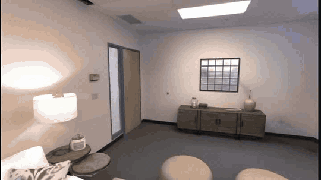
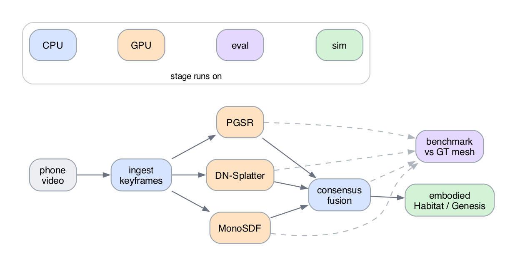
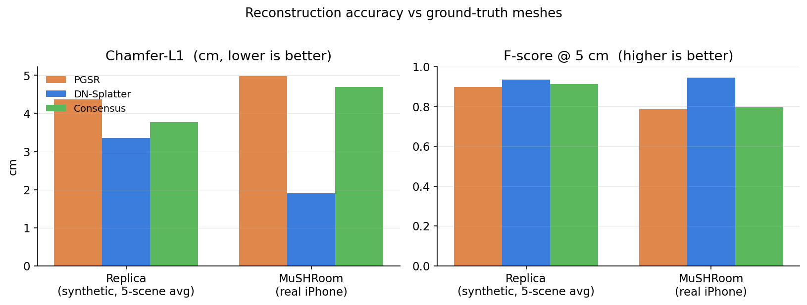
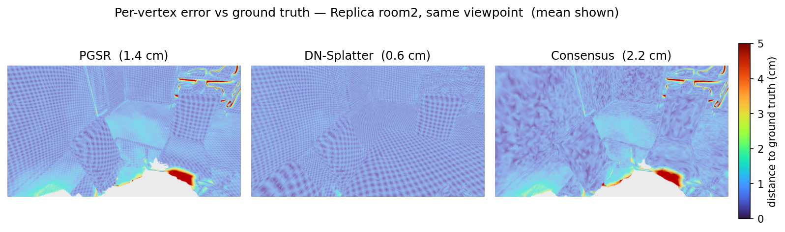
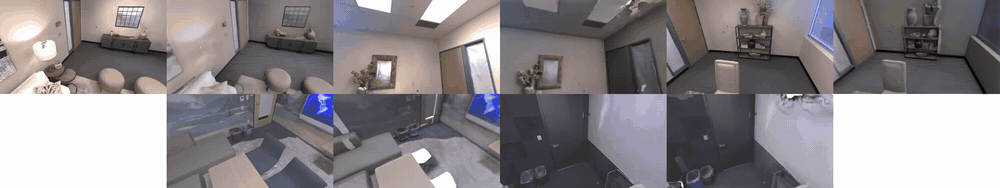
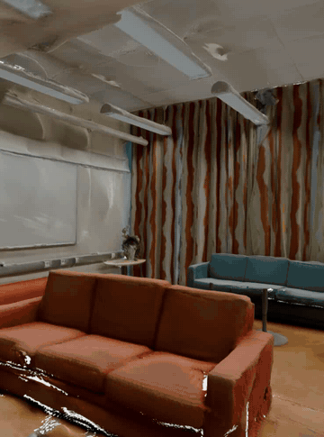
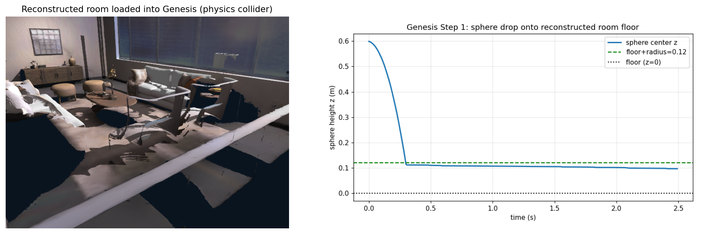
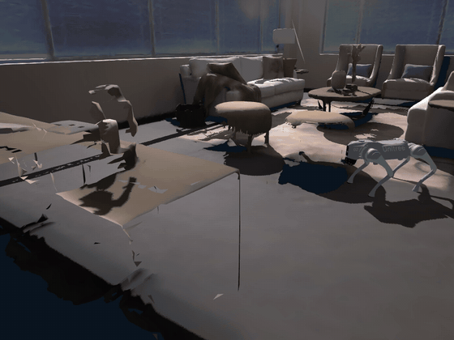

# Inhabit

Turn a phone video of a room into a 3D model that is correct to real-world scale, checked against ground truth, and ready to use as a robot environment in a physics simulator.

**Live site:** [www.inhabit.danilakozlov.com](https://www.inhabit.danilakozlov.com) (interactive 3D viewers and all the results).

Built for Humanoid's *From Video to 3D Reconstruction* challenge.

<p align="center">
  <br/>
  <em>The whole thing in one shot: phone capture, then a metric 3D reconstruction, then a robot walking around the reconstructed room at real scale.</em>
</p>

<p align="center">
  <br/>
  <em>Original video (left) and the reconstruction (right) for one benchmarked scene, rendered along the same camera path. The accuracy against the ground-truth mesh is sub-centimetre.</em>
</p>

## What it does

You record a short handheld video of a room. The pipeline then:

1. picks the sharp, well-spaced frames,
2. reconstructs the room three different ways,
3. merges the three results so they fill each other's gaps,
4. scores every result against a ground-truth mesh, in centimetres, and
5. loads the final model into a physics simulator, where a robot can stand on it, drop objects on it, and walk around.

The reconstruction methods themselves are existing research. The work here is what goes around them: a simple rule to merge them, a proper ground-truth benchmark (most phone-to-3D demos only report how good the result looks), real-world scale kept throughout, and the hand-off into a simulator.

## Pipeline

<p align="center">
  
</p>

```
phone video
  -> ingest        pick sharp, well-spaced frames                 [laptop]
  -> reconstruct   PGSR, DN-Splatter, MonoSDF                     [GPU]
  -> fuse          merge them, filling holes                       [laptop]
  -> benchmark     score against the ground-truth mesh, in cm      [GPU + laptop]
  -> embodied      load as a robot world in Habitat / Genesis      [laptop + sim]
```

The three reconstruction methods, all run on the same frames:

- **PGSR**: planar Gaussian splatting, converted to a mesh.
- **DN-Splatter**: Gaussian splatting guided by depth and surface-normal hints, converted to a mesh.
- **MonoSDF**: a neural distance field, converted to a mesh.

They fail in different ways. PGSR smooths over clutter, MonoSDF puffs the shape outward, and the splat-based meshes leave holes. Running all three on the same video shows where each one breaks, instead of trusting a single method's nice-looking output.

### Two places it runs

The laptop stages are a normal Python package (`pip install -e .`): ingest, fuse, benchmark, the viewers, and the simulator export. They run on a laptop with no GPU.

The three reconstruction methods are separate research codebases, each with its own CUDA setup and a few hours of GPU training. Those run on a GPU machine, driven by the scripts in `scripts/remote/`. I kept them separate rather than pretend that one `pip install` reproduces six GPU-hours of training.

### Run it

```bash
make install     # laptop stages
make benchmark   # rebuild the ground-truth table from the bundled metrics
make viewer      # serve the 3D viewers at http://localhost:8765

# merge any two coloured meshes
vid2scene fuse --backbone pgsr.ply --donor dn.ply --out consensus.ply
# export the metric mesh as a simulator-ready collider
vid2scene embodied --mesh consensus.ply --out room_sim.glb --scene-json scene.json
```

## Merging the three meshes

The merge keeps one mesh as the trusted base and only borrows from another where the base has holes. It never averages two surfaces together. Averaging two meshes that are each wrong in a different way just stacks their errors and produces doubled or thickened walls.

Given a base mesh `B`, a donor mesh `D`, and a distance threshold `tau`:

```
keep = { points of D that are more than tau away from the nearest point of B }
S    = all points of B  +  keep          # the donor only fills B's holes
mesh = ScreenedPoisson(S), then drop the lowest-density vertices
       and keep the largest connected piece
```

A smaller `tau` borrows more from the donor. The threshold is the whole trick: where `B` already has a surface, the donor is ignored, so two biased surfaces are never blended. Code: [`src/vid2scene/fuse/consensus.py`](src/vid2scene/fuse/consensus.py).

## Results

### How the scoring works

Every reconstruction is scored against a ground-truth mesh, so the numbers are real distances, not rendering quality.

| Metric | What it measures | Better |
|---|---|---|
| Accuracy | how far the reconstruction sits from the true surface | lower |
| Completion | how much of the true surface got reconstructed | lower |
| Chamfer-L1 | the average of Accuracy and Completion | lower |
| F-score @ 5 cm | fraction of surface within 5 cm, balancing the two | higher |
| Normal consistency | how well the surface orientations match | higher |

One step matters more than any other: **visibility culling**. You cannot fairly compare against the full ground-truth mesh, because every method invents geometry behind walls and outside the frame, and the ground truth contains surfaces the camera never saw. So before scoring, both the ground-truth mesh and every reconstruction are cut down to only the region the cameras actually observed, using the same camera poses. I use DN-Splatter's `eval_mesh_vis_cull.py` for every method, so the culling (poses, depths, thresholds) is identical across all of them.

A rough sanity check: a correct Replica room0 result lands around 1.5 to 5 cm Chamfer and 0.7 to 0.93 F-score. Numbers far outside that band mean an alignment or culling bug, not a real method difference.

### Replica (synthetic, with ground-truth meshes)

Replica ships a ground-truth mesh per room, which is why it is the benchmark here. Distances are in centimetres, averaged over five scenes (room0-2, office0-1). Rebuild with `make benchmark`, which reads the bundled metrics in `runs/replica_eval/`.

**Table 1. Five-scene average.**

| Method | Accuracy ↓ | Completion ↓ | Chamfer-L1 ↓ | Normal-C ↑ | F-score ↑ |
|---|---|---|---|---|---|
| PGSR | 1.13 | 7.60 | 4.37 | 0.938 | 0.898 |
| DN-Splatter | 0.57 | 6.14 | 3.36 | 0.965 | 0.936 |
| Consensus (merge) | 1.07 | 6.47 | 3.77 | 0.944 | 0.913 |

**Table 2. Chamfer-L1 per scene (cm).**

| Scene | PGSR | DN-Splatter | Consensus |
|---|---|---|---|
| room0 | 1.50 | 0.62 | 1.48 |
| room1 | 1.21 | 0.88 | 1.21 |
| room2 | 4.29 | 1.97 | 2.34 |
| office0 | 7.72 | 6.50 | 6.85 |
| office1 | 7.11 | 6.81 | 6.97 |
| average | 4.37 | 3.36 | 3.77 |

DN-Splatter is the most accurate single method, sub-centimetre on every scene. (Its own paper reports about 0.74 cm average over these scenes, so this is in line with the published numbers.) The merge does not beat it here, because most of these scenes have near-complete camera coverage and leave no holes to fill.

What the merge does do is improve the mesh it is built on, more so when the scene is harder. On the cluttered room2 it cuts the PGSR base's Chamfer-L1 from 4.29 to 2.34 cm. On the offices, where coverage is poorest, it also beats PGSR. The merge trades a little accuracy for better completeness: it helps when coverage is incomplete and is roughly a wash when coverage is already good.

<p align="center">
  <br/>
  <em>Tables 1 and 4 at a glance: Chamfer-L1 (lower is better) and F-score at 5 cm (higher is better), on the Replica average and on the real iPhone capture.</em>
</p>

<p align="center">
  <br/>
  <em>Each vertex of the room2 reconstruction coloured by its distance to the ground truth (0 to 5 cm). Blue is accurate, red is far off. DN-Splatter is cleanest; the merge's remaining error sits in the cluttered, low-coverage spots.</em>
</p>

All five benchmark scenes, input video (left) against reconstruction (right), played along the same camera path. Top row: room0, room1, room2. Bottom row: office0, office1.

<p align="center">
  
</p>

The reconstructions track the input closely on the rooms. The offices are dimmer and less fully covered, which is where the bigger errors in Table 2 come from.

### Flipping the base mesh

The merge above uses PGSR as the base and DN-Splatter as the gap-filler. Since DN-Splatter is the stronger method, the obvious thing to try is the reverse: DN-Splatter as the base, PGSR as the gap-filler. No retraining needed, just re-merge and re-score the meshes that already exist.

**Table 3. Chamfer-L1 (cm): DN-Splatter alone vs the DN-base merge.**

| Scene | DN-Splatter alone | DN-base merge |
|---|---|---|
| room0 | 0.62 | 1.91 |
| room1 | 0.88 | 1.01 |
| room2 | 1.97 | 2.05 |
| office0 | 6.50 | 6.71 |
| office1 | 6.81 | 6.48 |
| average | 3.36 | 3.63 |

It still does not beat DN-Splatter on these clean scenes: the extra Poisson step costs a little accuracy (0.57 to 0.79 cm on average), and there are too few holes to make up for it. But on the gappiest scene, office1, it wins outright (6.48 vs 6.81). Same conclusion as before: the merge helps exactly when coverage is poor.

### A real iPhone capture

The scenes above are rendered. I also ran the whole pipeline on a real handheld iPhone video with a Faro laser-scan ground-truth mesh (MuSHRoom `coffee_room`), using the same scoring.

**Table 4. Real iPhone capture (MuSHRoom `coffee_room`).**

| Method | Chamfer-L1 ↓ (cm) | F-score ↑ |
|---|---|---|
| PGSR | 4.98 | 0.785 |
| **DN-Splatter** | **1.91** | **0.946** |
| Consensus | 4.69 | 0.796 |

The result holds up on real data. DN-Splatter reconstructs the room to about 2 cm against the laser ground truth, and the merge again improves its PGSR base (4.98 to 4.69 cm) without beating DN-Splatter. Errors are higher than on the rendered scenes, which is expected for a real capture (sensor noise, pose error, motion blur).

<p align="center">
  <br/>
  <em>The real iPhone <code>coffee_room</code> reconstruction. Rougher than the rendered scenes, and accurate to about 2 cm against the laser ground truth.</em>
</p>

For reference, the Gaussian splat used for appearance reaches 32.3 PSNR on the Mip-NeRF 360 `room` scene, within 0.7 dB of the best published result there. That is just a check that the front end is competitive. It is a training-time number on a scene with no ground-truth mesh, so I do not treat it as a headline result.

## A robot in the room

The metric mesh is used as a robot environment two ways.

In **Habitat**, it becomes a navmesh that an agent walks.

In **Genesis** (a physics simulator), it becomes a rigid-body collider. Two things are implemented and checked:

- **Object drop.** The reconstructed room0 mesh is gravity-aligned (floor at z = 0) and loaded as a static collider. A sphere (radius 0.12 m) dropped from 0.6 m falls under gravity and comes to rest at z ≈ 0.098 m, which is floor-plus-radius within about 2 cm, with no tunnelling through the floor. This checks mesh import, scale, collision, and gravity together.
- **Go2 quadruped.** The Genesis Go2 robot (18 joints) spawns at 0.42 m and settles to a stable stance at z ≈ 0.29 m, held for four seconds under PD control.

<p align="center">
  <br/>
  <em>The reconstructed room as a rigid-body collider. The dropped sphere falls and rests on the floor at real scale (right), which is what confirms import, scale, collision, and gravity are all correct.</em>
</p>

<p align="center">
  <br/>
  <em>A Go2 walks a path across the reconstructed room0 floor in Genesis, fixed camera. The walk is kinematic: the base follows a clear, collision-free path with a trot gait, because physics-driven walking needs a trained policy. The physics itself (gravity, collision) is the sphere-drop check above.</em>
</p>

What is not done yet: a trained locomotion policy so the Go2 actually walks forward under physics (that policy lives in the Genesis GitHub repo, not the pip package), and the photoreal Genesis camera that would render the robot's own view straight from the Gaussian splat (it needs CUDA 12.9, and the GPU box is on 12.6). Reproduction note: pin `numpy<2`, since Genesis pulls in numpy 2.x, which breaks the torch 2.2 build.

The simulator export and the physics demos are in `scripts/genesis/`, with the rendered evidence in `scripts/genesis/outputs/`.

## Why this matters

A reconstruction that is metric and clean enough to load as a collider is more than a model: it is a place a robot can be trained and tested in. With a physics engine like [Genesis](https://github.com/Genesis-Embodied-AI/genesis-world), a phone turns into an environment generator.

- **Training data.** Each scan is a simulation-ready room at real scale. Randomise the lighting, textures, and object placement; render first-person views along sampled paths; log contacts and depth. One short video becomes a lot of labelled training data, with no capture rig and no hand-built scenes.
- **Testing in real, varied places.** Robot policies usually get tested in a handful of hand-made sim rooms. Here a new test room is just a phone video: kitchens, stairwells, cluttered offices, the long tail of real spaces. Coverage that would take an artist days per scene costs a one-minute walk-through.
- **Reusing data you already have.** First-person and teleoperation footage recorded in the field can be turned back into simulator rooms and replayed as training environments. That closes the loop: deploy, record, reconstruct, and re-test the next policy in the exact situations the robot actually ran into, instead of scenes an artist guessed at.

The benchmark is the same idea one level down: before trusting a reconstruction as an environment, measure it. The centimetre numbers above are what let a generated room be used with known error bounds instead of on faith.

## Limitations

- **Coverage.** The camera cannot reconstruct what it never saw. The pipeline either fills those gaps by interpolation or leaves them open, and which one is stated per result. This is a property of single-pass capture, not of any one method. The per-vertex error map above shows it: the error concentrates where the camera looked least.
- **The merge is conditional.** It improves its base mesh and helps most on cluttered or low-coverage scenes, but it does not beat the best single method on clean, fully-observed scenes. It trades a little accuracy for completeness rather than improving both.
- **Scale needs a cue.** Real-world units come from the capture's poses or depth (ARKit or sensor depth). A purely monocular video with no scale cue is only recovered up to an overall scale factor.
- **The benchmark is small.** Five rendered Replica scenes and one real iPhone capture. A larger real-data sweep would make the claims stronger.
- **Geometry only.** No semantic labels in this version.
- **Embodiment is partial.** Habitat navigation and Genesis physics (object drop, robot stand) work. Forward walking needs a trained policy, and the photoreal in-sim camera needs CUDA 12.9.

## Reproduce the benchmark

```bash
# 1. data (no login): Nice-SLAM Replica, ships ground-truth meshes
wget -c https://cvg-data.inf.ethz.ch/nice-slam/data/Replica.zip && unzip Replica.zip
# 2. convert a scene to each method's input
#    (COLMAP for PGSR, transforms.json for DN-Splatter, cameras.npz for MonoSDF)
# 3. train each method on a GPU box (MonoSDF is the long one, ~6-12 h)
# 4. merge:  python scripts/remote/fuse_consensus.py --pgsr P.ply --dn DN.ply --out consensus.ply
# 5. score every mesh with the SAME culling harness:
#    python dn_splatter/eval/eval_mesh_vis_cull.py --gt-mesh-path roomN_mesh.ply \
#      --pred-mesh-path MESH.ply --transformation_file transforms.json \
#      --dataset_path roomN --dataset_type replica
```

## Repository layout

```
src/vid2scene/      laptop stages and the CLI (ingest, fuse, benchmark, viz, embodied)
scripts/remote/     GPU reconstruction + benchmark backend (PGSR / DN-Splatter / MonoSDF / fuse / eval)
scripts/genesis/    Genesis physics (object drop, Go2 stand and walk) + rendered outputs
scripts/            TSDF meshing, Habitat navmesh and path recording, rendering
viewer/             three.js and Gaussian-splat web viewers
runs/               outputs and the bundled ground-truth metrics (replica_eval/)
docs/               extended engineering notes and the deploy guide
```

| Part | What it does |
|---|---|
| `src/vid2scene/ingest/` | pick frames (blur gate + spacing) and write an HTML report |
| `src/vid2scene/fuse/` | the consensus merge (`consensus.py`) |
| `src/vid2scene/benchmark/` | collate the ground-truth metrics into a table |
| `src/vid2scene/viz/` | mesh decimation for the web viewers |
| `src/vid2scene/embodied/` | export a simulator-ready GLB for Genesis or Habitat |
| `scripts/remote/` | per-method setup and launch scripts, the fuse and eval drivers, and `tb.sh` (the GPU-box SSH helper) |
| `scripts/genesis/` | the Genesis physics demos and their rendered evidence |
| `viewer/` | the interactive web viewers |
| `runs/replica_eval/` | bundled metric JSONs so `make benchmark` rebuilds the table offline |

### Interactive viewers

Live at [www.inhabit.danilakozlov.com](https://www.inhabit.danilakozlov.com), or run `make viewer` locally:

- `viewer/replica_room0.html`: the reconstruction toggled against the Replica ground-truth mesh.
- `viewer/mesh_compare.html`: the three methods and the merge aligned in one frame.
- `viewer/splat_ref.html`: the reference Gaussian splat.

## References

Reconstruction and surface methods:
- Chen et al. *PGSR: Planar-based Gaussian Splatting Reconstruction.* TVCG 2024. [arXiv:2406.06521](https://arxiv.org/abs/2406.06521)
- Turkulainen et al. *DN-Splatter: Depth and Normal Priors for Gaussian Splatting.* WACV 2025. [arXiv:2403.17822](https://arxiv.org/abs/2403.17822)
- Yu et al. *MonoSDF: Exploring Monocular Geometric Cues for Neural Implicit Surface Reconstruction.* NeurIPS 2022. [arXiv:2206.00665](https://arxiv.org/abs/2206.00665)
- Kazhdan and Hoppe. *Screened Poisson Surface Reconstruction.* ACM ToG 2013.
- Wang et al. *GO-Surf.* 3DV 2022. [arXiv:2206.14735](https://arxiv.org/abs/2206.14735)
- Li et al. *Neuralangelo.* CVPR 2023.

Embodied and real-to-sim:
- Khanna et al. *EmbodiedSplat.* ICCV 2025. [arXiv:2509.17430](https://arxiv.org/abs/2509.17430)
- *VR-Robo.* RA-L 2025. [arXiv:2502.01536](https://arxiv.org/abs/2502.01536)
- *GaussGym.* 2025. [arXiv:2510.15352](https://arxiv.org/abs/2510.15352)
- Genesis-Embodied-AI. *Genesis.* https://github.com/Genesis-Embodied-AI/genesis-world

Datasets:
- Straub et al. *The Replica Dataset.* 2019.
- Ren et al. *MuSHRoom: Multi-Sensor Hybrid Room Dataset.* WACV 2024.
- Barron et al. *Mip-NeRF 360.* CVPR 2022.

## Author

**Danila Kozlov**, AI researcher and operator. Previously a Member of Technical Staff at an AI neolab, leading benchmarking, infrastructure, and multi-agent research. Earlier: Anthropic, Amazon Web Services, and Cisco.

[Website](https://www.danilakozlov.com) ·
[LinkedIn](https://www.linkedin.com/in/danilakozlov/) ·
[GitHub](https://github.com/uhDann)
