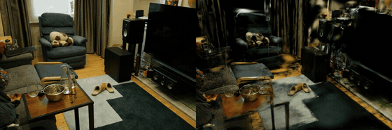
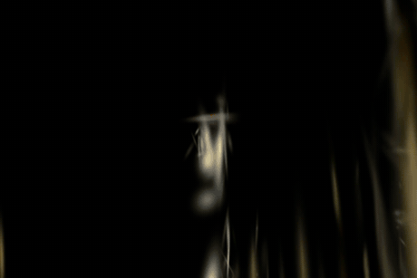

# vid2scene

### Phone video → **metric** 3D reconstruction → a room a **robot can explore**.

A short phone video of a small indoor room goes in. Out comes a geometrically
coherent, **metric-scale** 3D reconstruction — and then we do the thing nobody
else does: we drop a robot into it and let it navigate, with its camera
re-rendered photorealistically from the scene.

Built for Humanoid's *From Video to 3D Reconstruction* challenge. The challenge
asks for a geometrically coherent reconstruction; we treat that as the *start*,
not the finish, and push it toward what a humanoid actually needs: **metric
geometry it can act in, geometry you can trust, and an embodied world to learn in.**

<p align="center">
  <br/>
  <em>Left: original video. Right: our reconstruction, rendered along the same path.</em>
</p>

---

## Why this is different

The obvious, standard approach to this challenge is a single linear pipeline:
`feed-forward geometry → 3DGS → SAM/CLIP labels → a web viewer`. We deliberately
went elsewhere — toward what a robot actually needs. Three things that approach
leaves on the table:

| | What | Why it matters for a *humanoid* |
|---|---|---|
| 🤖 **Embodied world** | The metric mesh becomes a **robot-explorable environment** — Habitat navmesh + an agent whose first-person view is re-rendered from the Gaussian splat (Genesis physics-RL upgrade designed in [`docs/PHASE2_GENESIS.md`](docs/PHASE2_GENESIS.md)). | A reconstruction a robot can *act in* is the actual product. Metric scale makes "can a 1.6 m robot fit through this gap" a real question. |
<!-- agent walkthrough: the embodied payoff -->

<p align="center">
  <br/>
  <em>An agent autonomously navigates the reconstructed room; its first-person view is rendered photorealistically from the Gaussian splat.</em>
</p>
| 📏 **Trustworthy geometry** | We run **three** reconstructors (PGSR, DN-Splatter, MonoSDF) and **fuse** them by consensus, then **benchmark every mesh against ground-truth meshes** (Replica, Chamfer / F-score). | "Quality of reconstruction" backed by *numbers vs ground truth*, not screenshots. |
| 🔬 **Consensus fusion** | A novel gap-fill fusion: a trusted backbone + donor geometry only where the backbone has holes. | One method's blind spot is another's strength; fusion makes the geometry more complete where it's hard. |

> Honest framing: the reconstruction backbones are off-the-shelf SOTA. The
> original work is **putting them in tension** (multi-method + consensus +
> a real benchmark) and **carrying the result all the way into an embodied sim.**

---

## See it in 60 seconds (no GPU)

```bash
make install          # CPU stages only
make demo             # prints the GT-mesh benchmark table + viewer URLs
make viewer           # serve the interactive viewers at http://localhost:8765
```

Then open:
- **`viewer/replica_room0.html`** — our reconstruction vs **ground-truth** mesh (toggle to compare; Chamfer 0.62 cm).
- **`viewer/mesh_compare.html`** — all four meshes + the consensus, aligned.
- **`viewer/splat_ref.html`** — the reference Gaussian splat (PSNR 32.3, within 0.7 dB of SOTA on this scene).

Example media in [`examples/`](examples) and `runs/` (input video, photoreal
agent walkthrough, original-vs-reconstruction compare).

---

## Results

### Quality vs ground truth (Replica, visibility-culled, cm · F-score@5cm)

Reproduce locally: `make benchmark` (reads bundled metrics in `runs/replica_eval/`).

| | Accuracy ↓ | Completion ↓ | Chamfer-L1 ↓ | F-score ↑ |
|---|---|---|---|---|
| PGSR | 1.13 | 7.60 | 4.37 | 0.898 |
| **DN-Splatter** | **0.57** | **6.14** | **3.36** | **0.936** |
| **Consensus (ours)** | 1.07 | 6.47 | 3.77 | 0.913 |

5-scene average (room0/1/2, office0/1). **Sub-centimetre accuracy** — the
reconstruction is genuinely close to ground truth. Full per-scene table,
protocol, and the honest analysis of *when fusion helps* in
[`docs/BENCHMARK.md`](docs/BENCHMARK.md).

### What the benchmark taught us (and we report honestly)

- DN-Splatter is the strongest single method across all 5 scenes.
- The consensus **reliably improves its backbone and the gain grows with scene
  difficulty** — on the gappy `room2` it cuts PGSR's Chamfer **4.29 → 2.34 cm
  (−45%)**; on the cluttered `office1` the DN-backbone consensus **beats
  DN-Splatter outright** (6.48 vs 6.81 cm). Fusion trades a little accuracy for
  more completeness — a net win exactly where coverage is poor.

---

## How it works

```
phone video → [ingest] → [reconstruct ×3] → [fuse: consensus] → [benchmark vs GT] → [embodied: robot world]
                CPU          GPU                  CPU                  GPU+CPU            CPU export + sim
```

Full repo map, per-stage code locations, and run commands:
[`docs/ARCHITECTURE.md`](docs/ARCHITECTURE.md).

The CPU stages are a normal `pip install -e .` package and run on a laptop
(`vid2scene ingest|fuse|benchmark|viz|embodied`). The reconstruction stage runs
three SOTA repos on a CUDA box, driven by [`scripts/remote/`](scripts/remote).

```bash
# fuse any two coloured meshes (CPU, ~30 s)
vid2scene fuse --backbone pgsr.ply --donor dn.ply --out consensus.ply
# export the metric mesh as a sim-ready collider for Habitat/Genesis
vid2scene embodied --mesh consensus.ply --out room_sim.glb --scene-json scene.json
```

---

## Design choices & tradeoffs

- **Three methods, not one.** A single pipeline can't tell you whether its
  geometry is right. Running PGSR / DN-Splatter / MonoSDF and scoring all of
  them against GT meshes turns "looks good" into a number — and exposes exactly
  where each fails (planar reg smooths clutter; SDF balloons; splats leave holes).
- **Consensus, not averaging.** The fusion literature is clear that blindly
  averaging geometrically-biased meshes makes doubled walls and smears detail.
  We use a **gated** fusion (backbone + donor-only-in-holes) — see
  [`src/vid2scene/fuse/consensus.py`](src/vid2scene/fuse/consensus.py).
- **Metric from the start.** Real-world scale is what makes the embodied stage
  meaningful — a monocular pipeline that can't measure the room can't tell a
  robot whether it fits through a gap.
- **Honest about coverage.** Unobserved walls *cannot* be recovered faithfully
  (we show the capture-coverage diagnosis in `docs/figures/`); we fill them or
  leave them honestly, and say which.
- **Two environments on purpose.** We don't pretend one `pip install`
  reproduces 6 GPU-hours of training; `scripts/remote/*.sh` are the exact drivers.

## Mapping to the challenge criteria

| Criterion | Where |
|---|---|
| Simplicity & usability | `make demo` / one-command CPU stages / bundled results |
| Creativity (not a standard solution) | multi-method **consensus fusion** + **embodied Genesis/Habitat** world |
| Quality of 3D reconstruction | **GT-mesh benchmark** (sub-cm), reference splat PSNR 32.3 |
| Compelling presentation | interactive viewers, recon-vs-GT toggle, photoreal agent video |
| Geometry/semantics coherence | metric geometry drives the navmesh + sim collider directly |

## Repo layout

```
src/vid2scene/   ingest · fuse · benchmark · viz · embodied   (pip-installable CPU stages)
scripts/remote/  GPU reconstruction + benchmark backend       (PGSR / DN-Splatter / MonoSDF / fusion / eval)
scripts/         TSDF mesh · Habitat navmesh + path · photoreal render
viewer/          three.js + GaussianSplats3D web viewers
docs/            ARCHITECTURE · BENCHMARK · PHASE2_GENESIS · FINDINGS
runs/            outputs + bundled GT-mesh metrics (replica_eval/)
examples/        sample input video + outputs
```

See [`docs/ARCHITECTURE.md`](docs/ARCHITECTURE.md) to get oriented.
