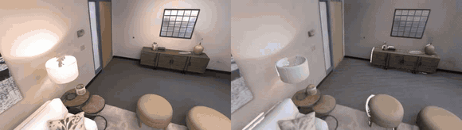
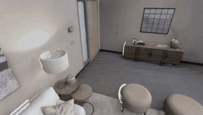
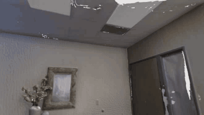
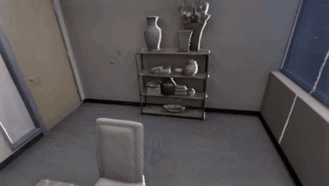
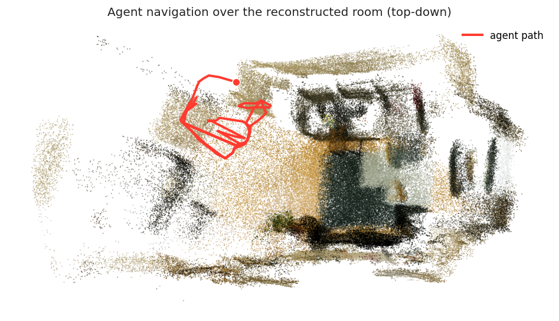

# vid2scene

From a phone video of a room to a metric 3D reconstruction, evaluated against
ground truth and usable as an embodied environment.

A short handheld video of a small indoor room is reconstructed into a metric,
geometrically coherent 3D scene. The project runs three independent
surface-reconstruction methods on the same capture, fuses them with a gated
consensus rule, and evaluates every result against ground-truth meshes. The
resulting metric mesh is then loaded as a navigable environment in which an
agent's first-person view is rendered from the scene.

Built for Humanoid's *From Video to 3D Reconstruction* challenge.

<p align="center">
  <br/>
  <em>A benchmarked scene (Replica room0): the original video (left) and our reconstruction (right), rendered along the same camera path. Accuracy against the ground-truth mesh is sub-centimetre.</em>
</p>

## Contributions

The reconstruction backbones are existing state-of-the-art methods. The work
here is the methodology around them.

**1. Multi-method comparison.** Most video-to-3D systems use a single
reconstructor. We run three methodologically distinct methods on the same
capture: [PGSR](https://arxiv.org/abs/2406.06521) (planar Gaussian splatting to a
TSDF mesh), [DN-Splatter](https://arxiv.org/abs/2403.17822) (Gaussian splatting
with monocular depth and normal priors to a TSDF mesh), and
[MonoSDF](https://arxiv.org/abs/2206.00665) (a neural signed-distance field to a
marching-cubes mesh). Comparing them shows where each one fails. Planar
regularization smooths over clutter, the SDF over-inflates, and the
splat-derived TSDF leaves holes.

**2. Gated consensus fusion.** We fuse the meshes by taking one as a backbone and
adding geometry from another only where the backbone has holes, then fitting a
single [screened-Poisson](https://www.cs.jhu.edu/~misha/MyPapers/ToG13.pdf)
surface to the combined points. We avoid volumetric averaging on purpose.
Averaging surfaces with different systematic biases superimposes their errors and
produces doubled or thickened walls. We do not claim a new fusion algorithm. We
claim a simple gating rule and a measured account of when it helps.

**3. Evaluation against ground truth.** We score every mesh and the fusion against
Replica ground-truth meshes using the standard surface-reconstruction protocol
([GO-Surf](https://arxiv.org/abs/2206.14735),
[MonoSDF](https://arxiv.org/abs/2206.00665),
[Neuralangelo](https://research.nvidia.com/labs/dir/neuralangelo/)):
visibility-culled Accuracy, Completion, Chamfer-L1, F-score at 5 cm, and
Normal-Consistency. The protocol is standard in the reconstruction literature.
Applying it to a casual phone-capture pipeline, where rendering quality is
usually the only number reported, is uncommon.

**4. Metric scale.** Monocular reconstruction recovers shape only up to an unknown
global scale factor. We keep the reconstruction in real-world units, because the
questions that matter for a robot, such as clearance, collision margins, and
reachability, are only well-posed at true scale. A scale-free mesh can render
correctly and still give wrong answers to all of them.

**5. Embodied use.** The metric mesh is loaded as a navigable environment (a
Habitat navmesh), and an agent walks the room with its first-person view rendered
from the Gaussian splat. This is a systems integration on top of the
real-to-sim-via-splatting line of work
([EmbodiedSplat](https://arxiv.org/abs/2509.17430),
[VR-Robo](https://arxiv.org/abs/2502.01536),
[GaussGym](https://arxiv.org/abs/2510.15352)), not a new simulator. A
Genesis-based physics and reinforcement-learning version is designed but not yet
implemented ([docs/PHASE2_GENESIS.md](docs/PHASE2_GENESIS.md)).

### The fusion, precisely

Given a trusted backbone mesh `B`, a donor mesh `D`, and a distance threshold `tau`:

```
keep = { d in vertices(D) : dist(d, nearest vertex of B) > tau }   # donor fills only B's holes
S    = oriented, coloured points of B  ∪  keep
M    = ScreenedPoisson(S), then trim the lowest-density vertices and keep the
       largest connected component
```

`tau` controls how aggressively the donor fills (smaller `tau` borrows more).
The gate is what prevents the doubled-surface artifact: where `B` already has a
surface, the donor is ignored, so two biased surfaces are never averaged.
Implementation: [`src/vid2scene/fuse/consensus.py`](src/vid2scene/fuse/consensus.py).

## Results

Table 1 reports reconstruction accuracy against Replica ground-truth meshes,
averaged over five scenes (room0-2, office0-1). All meshes are visibility-culled
before scoring. Distances are in centimetres; F-score uses a 5 cm threshold.
Reproduce with `make benchmark`, which reads the bundled metrics in
`runs/replica_eval/`.

**Table 1. Five-scene average.**

| Method | Accuracy ↓ | Completion ↓ | Chamfer-L1 ↓ | Normal-C ↑ | F-score ↑ |
|---|---|---|---|---|---|
| PGSR | 1.13 | 7.60 | 4.37 | 0.938 | 0.898 |
| DN-Splatter | 0.57 | 6.14 | 3.36 | 0.965 | 0.936 |
| Consensus (fusion) | 1.07 | 6.47 | 3.77 | 0.944 | 0.913 |

DN-Splatter is the most accurate single method, with sub-centimetre accuracy on
every scene. The consensus fusion does not beat the best single method on these
scenes, most of which have near-complete camera coverage. What the fusion does is
improve the mesh it is built on, and the improvement grows with scene difficulty.
Table 2 gives the Chamfer-L1 per scene.

**Table 2. Chamfer-L1 per scene (cm).**

| Scene | PGSR | DN-Splatter | Consensus |
|---|---|---|---|
| room0 | 1.50 | 0.62 | 1.48 |
| room1 | 1.21 | 0.88 | 1.21 |
| room2 | 4.29 | 1.97 | 2.34 |
| office0 | 7.72 | 6.50 | 6.85 |
| office1 | 7.11 | 6.81 | 6.97 |
| average | 4.37 | 3.36 | 3.77 |

On the cluttered `room2` the fusion lowers the PGSR backbone's Chamfer-L1 from
4.29 to 2.34 cm. On `office1`, where camera coverage is poorest, a variant that
uses DN-Splatter as the backbone reaches 6.48 cm against DN-Splatter's own
6.81 cm. The fusion trades a small amount of accuracy for better completion,
which helps when coverage is incomplete and is roughly neutral when coverage is
already good. The full per-scene metrics and the backbone ablation are in
[docs/BENCHMARK.md](docs/BENCHMARK.md).

Interior fly-throughs of the recovered meshes for three benchmark scenes
(living room, bedroom, study):

<p align="center">
  
  
  
</p>

For reference, the Gaussian splat used as the appearance model reaches 32.3 PSNR
on the Mip-NeRF 360 `room` scene, within 0.7 dB of the best published result on
that scene. This is a check that the front end is competitive, not a headline
result.

## How it works

```
phone video
  -> ingest        keyframe selection (blur gate + parallax spacing)      [CPU]
  -> reconstruct   PGSR, DN-Splatter, MonoSDF                             [GPU]
  -> fuse          gated consensus (backbone + donor-in-holes)            [CPU]
  -> benchmark     visibility-culled Chamfer / F-score vs GT mesh         [GPU+CPU]
  -> embodied      metric mesh -> Habitat navmesh -> splat-rendered agent [CPU + sim]
```

The CPU stages install with `pip install -e .` and run on a laptop. The three
reconstructors run on a CUDA host, driven by [`scripts/remote/`](scripts/remote).
The full repo map and per-stage code locations are in
[docs/ARCHITECTURE.md](docs/ARCHITECTURE.md).

```bash
make install            # CPU stages
make benchmark          # reproduce the ground-truth table from bundled metrics
make viewer             # serve the interactive viewers at http://localhost:8765

# fuse any two coloured meshes (CPU)
vid2scene fuse --backbone pgsr.ply --donor dn.ply --out consensus.ply
# export the metric mesh as a sim-ready collider
vid2scene embodied --mesh consensus.ply --out room_sim.glb --scene-json scene.json
```

### Interactive viewers

- `viewer/replica_room0.html` toggles the reconstruction against the Replica ground-truth mesh.
- `viewer/mesh_compare.html` shows the three methods and the fusion aligned in one frame.
- `viewer/splat_ref.html` shows the reference Gaussian splat.

<p align="center">
  <br/>
  <em>The metric mesh is loaded as a Habitat navmesh. Top-down view of a recorded agent trajectory over the reconstructed room.</em>
</p>

## Design choices

- **Three methods, because one cannot self-validate.** Comparing distinct
  reconstruction families against ground truth turns a visual impression into a
  measurement and shows where each one breaks.
- **Gating rather than averaging.** The fusion borrows geometry only in backbone
  holes, which avoids the doubled-surface artifact that averaging biased meshes
  produces. The benefit is conditional, and the condition is reported.
- **Metric units from the start,** because the embodied stage depends on them.
- **Explicit about coverage.** Surfaces the camera never observed cannot be
  recovered faithfully. We either fill them and say so or leave them, and the
  capture-coverage diagnosis is shown in [docs/figures](docs/figures).
- **Two environments by design.** A single `pip install` does not reproduce hours
  of GPU training, so the training drivers live in
  [`scripts/remote/`](scripts/remote) and are documented rather than hidden.

## Limitations

- **Coverage.** Surfaces the camera never observed cannot be recovered. The
  pipeline either fills them by interpolation (screened Poisson) or leaves them
  open, and the choice is stated per result. This is a property of single-pass
  capture, not of any one method.
- **The fusion is conditional.** The gated consensus improves its backbone and
  helps most on cluttered or low-coverage scenes, but it does not beat the
  strongest single method on clean, fully-observed scenes. It trades a little
  accuracy for completeness rather than improving both.
- **Metric scale depends on the input.** Real-world units come from the
  capture's poses or depth priors (ARKit or sensor depth). A purely monocular
  capture with no scale cue is recovered only up to a global scale factor.
- **Benchmark is synthetic.** The ground-truth numbers are on Replica (rendered
  scenes). A real-capture evaluation on MuSHRoom (Faro-laser ground truth) is
  reported separately; real numbers are lower, as expected.
- **Geometry only.** Semantic labelling is out of scope in this version.
- **Embodiment is partial.** The Habitat navigation stage is implemented; the
  Genesis physics-and-RL stage is designed (see `docs/PHASE2_GENESIS.md`).

## Repository layout

```
src/vid2scene/   ingest, fuse, benchmark, viz, embodied      (pip-installable CPU stages + CLI)
scripts/remote/  GPU reconstruction and benchmark backend    (PGSR / DN-Splatter / MonoSDF / fusion / eval)
scripts/         TSDF meshing, Habitat navmesh + path, photoreal rendering
viewer/          three.js and Gaussian-splat web viewers
docs/            ARCHITECTURE, BENCHMARK, PHASE2_GENESIS, FINDINGS
runs/            outputs and the bundled ground-truth metrics (replica_eval/)
```

Start at [docs/ARCHITECTURE.md](docs/ARCHITECTURE.md).

## References

Reconstruction and surface methods:
- Chen et al. *PGSR: Planar-based Gaussian Splatting Reconstruction.* TVCG 2024. [arXiv:2406.06521](https://arxiv.org/abs/2406.06521)
- Turkulainen et al. *DN-Splatter: Depth and Normal Priors for Gaussian Splatting.* WACV 2025. [arXiv:2403.17822](https://arxiv.org/abs/2403.17822)
- Yu et al. *MonoSDF: Exploring Monocular Geometric Cues for Neural Implicit Surface Reconstruction.* NeurIPS 2022. [arXiv:2206.00665](https://arxiv.org/abs/2206.00665)
- Kazhdan and Hoppe. *Screened Poisson Surface Reconstruction.* ACM ToG 2013.
- Wang et al. *GO-Surf.* 3DV 2022. [arXiv:2206.14735](https://arxiv.org/abs/2206.14735)
- Li et al. *Neuralangelo.* CVPR 2023.

Embodied / real-to-sim:
- Khanna et al. *EmbodiedSplat.* ICCV 2025. [arXiv:2509.17430](https://arxiv.org/abs/2509.17430)
- *VR-Robo.* RA-L 2025. [arXiv:2502.01536](https://arxiv.org/abs/2502.01536)
- *GaussGym.* 2025. [arXiv:2510.15352](https://arxiv.org/abs/2510.15352)
- Genesis-Embodied-AI. *Genesis.* https://github.com/Genesis-Embodied-AI/genesis-world

Datasets:
- Straub et al. *The Replica Dataset.* 2019.
- Ren et al. *MuSHRoom: Multi-Sensor Hybrid Room Dataset.* WACV 2024.
- Barron et al. *Mip-NeRF 360.* CVPR 2022.

